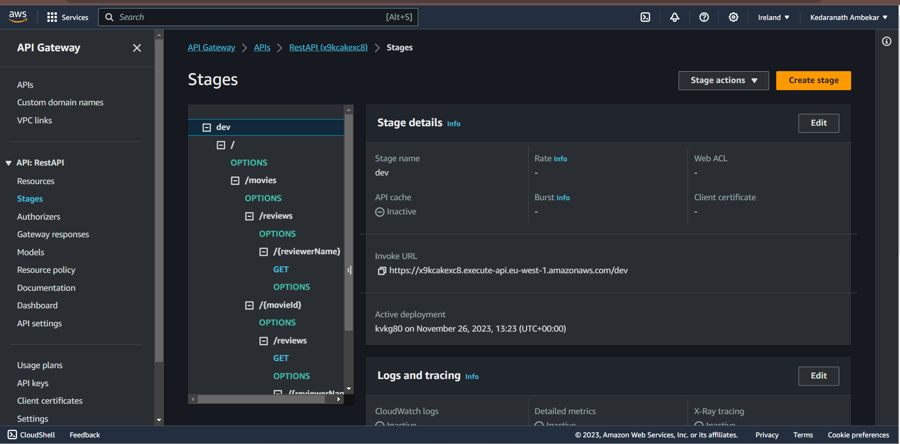

## ServerlessREST Assignment - Distributed Systems.

__Name:__ Kedaranath Ambekar
__Student No:__ 20091631

This repository contains the implementation of a serverless REST API for the AWS platform. A CDK stack creates the infrastructure. The domain context of the API is movie reviews.

### API endpoints.
 
__App API:__
+ GET /movies/reviews/{reviewerName} - Get all reviews written by a specific reviewer (across all movies)
+ GET /movies/{movieId}/reviews - Get all reviews for a specific movie.
+ GET /movies/{movieId}/reviews?minRating=n - Get all reviews for a specific movie with a rating greater than or equal to the specified minimum rating.
+ GET /movies/{movieId}/reviews/{reviewerName} - Get a review for a specific movie written by an input reviwerName.
+ GET /movies/{movieId}/reviews/{year} - Get all reviews for a specific movie written during an input year.




### forget to show this GET in the video


### Steps to run

```
npm install
npm run schema
cdk deploy
